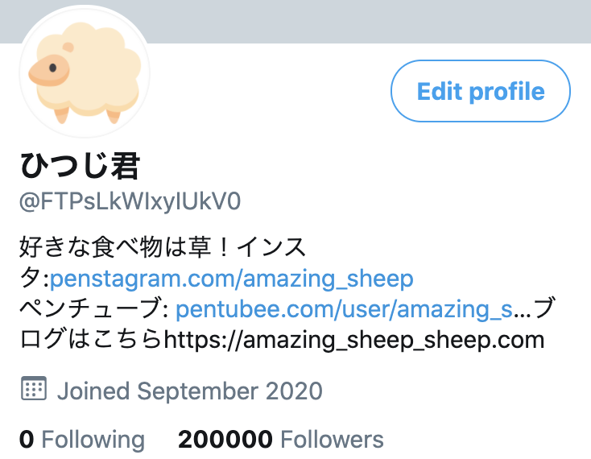

# TwiLink(ツイリンク)

TwiLinkとは、Twitterのプロフィール欄にリンクを沢山貼りたいけど、ツイッターのプロフィールがゴチャゴチャしてしまう...




という人に向けて作られたウェブアプリです。以下の画像のような自分だけのリンク集ページを作成する事が出来ます。


↓ 何種類かテーマーを選ぶ事が出来るので、自分に合ったものをお選びください！


## 本番環境

https://twilink.click


## 製作者

[manaki (デザイン・開発)](https://twitter.com/mikeanakida)  

[146 (ロゴ作成)](https://twitter.com/zyung_zyung)

## 動作確認

```bash
# install dependencies
$ npm install

# generate template data
$ npm run doc

# serve with hot reload at localhost:3000
$ npm run dev

# build for production and launch server
$ npm run build
$ npm run start

# generate static project
$ npm run generate
```
For detailed explanation on how things work, check out [Nuxt.js docs](https://nuxtjs.org).
